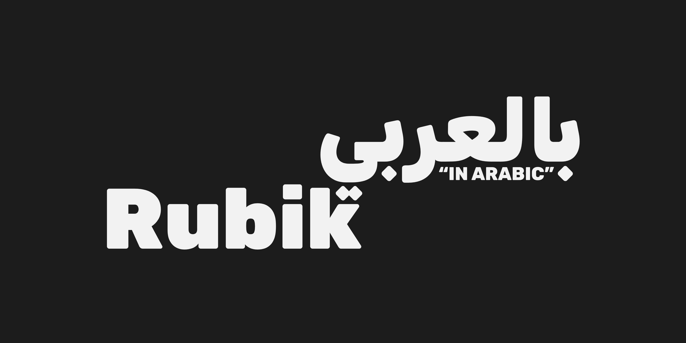
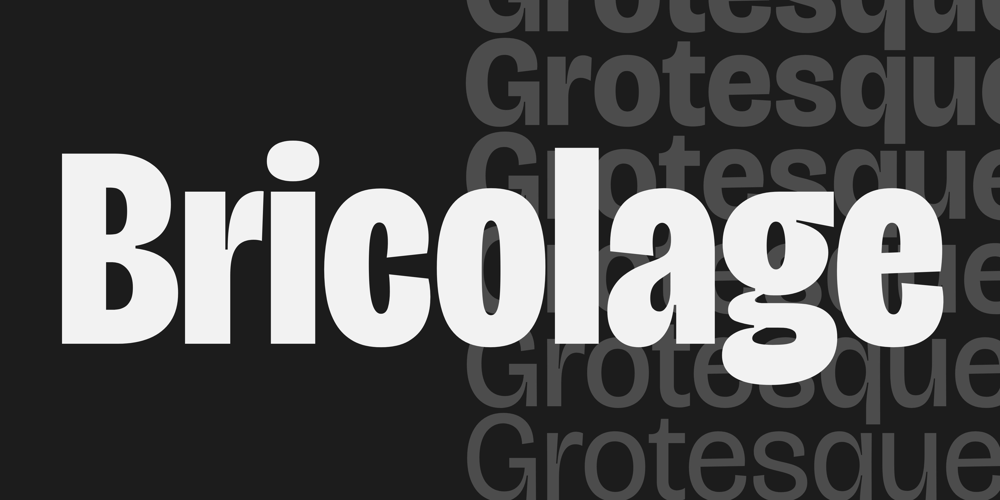

# GF Specimen Images Demo

## Building

* `make images` will produce new png images from Python source files.

## License

All font software used licensed under the SIL Open Font License, Version 1.1.
This license is available with a FAQ at
https://scripts.sil.org/OFL

All images produced are licensed Attribution-ShareAlike 4.0 International (CC BY-SA 4.0)
https://creativecommons.org/licenses/by-sa/4.0/